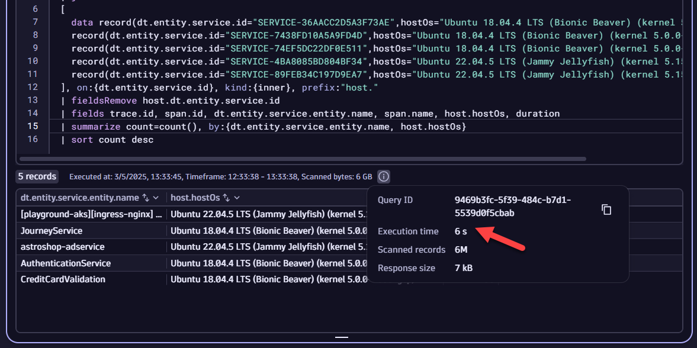
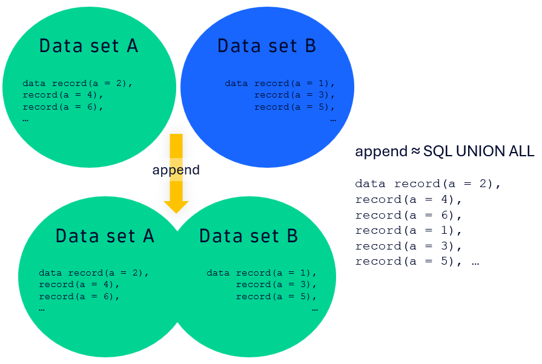
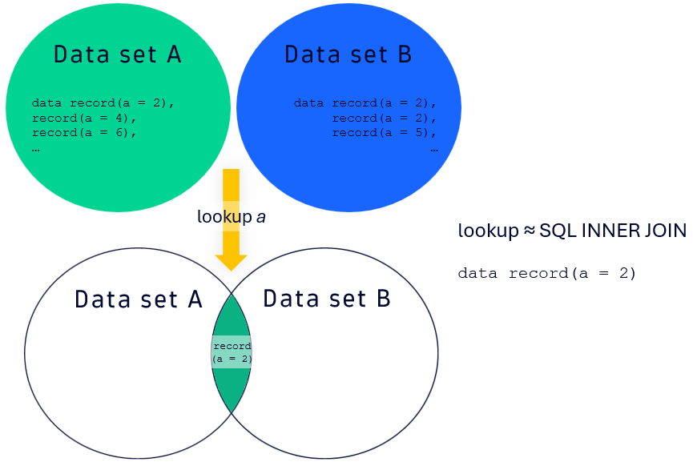
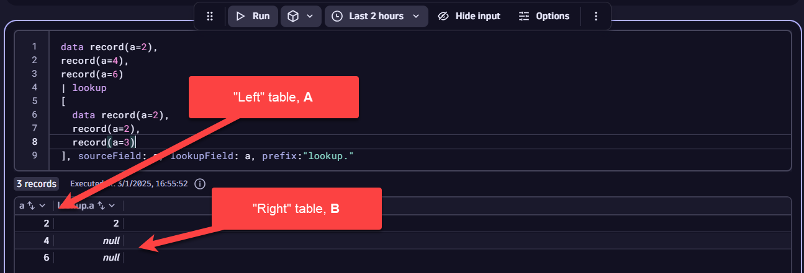
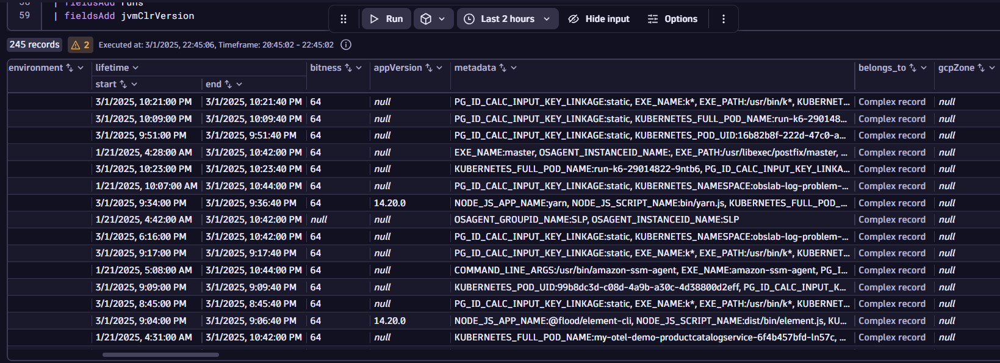
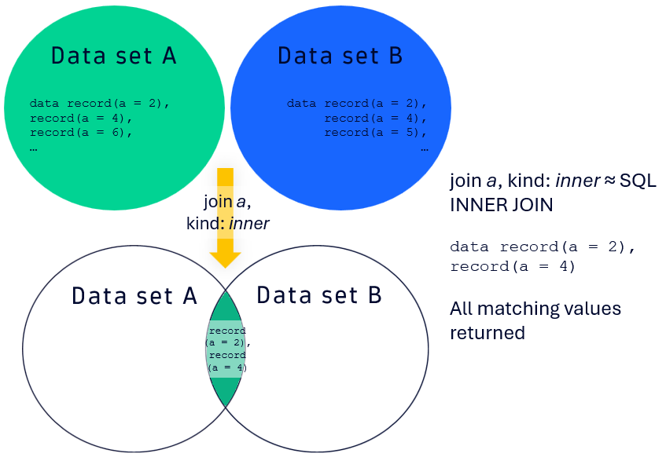
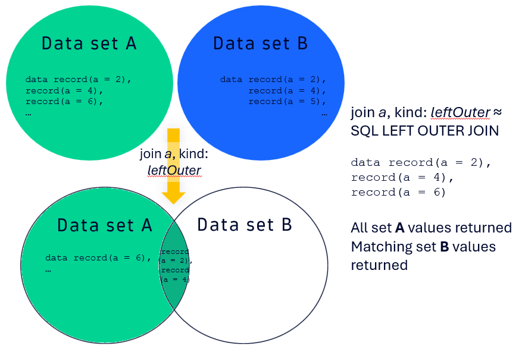
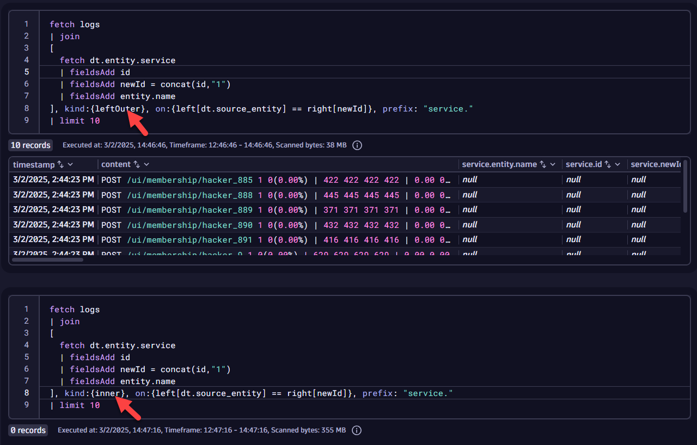

# Data Transformation

--8<-- "snippets/send-bizevent/3-data-transformation.js"

In this lab module, we will explore how to transform data from various sources using `join`, `lookup`, `append`, and `data` commands. We will look at data from logs, traces, the entity model, and raw sources to accomplish this.

**Lab Tasks:**
  1. Adding Data with `data` and `append`
  2. Connecting Data with `join` and `lookup`
  3. Wrap Up

## Adding Data with `data` and `append` 

### Import Notebook into Dynatrace

[Notebook](https://github.com/dynatrace-wwse/enablement-dql-301/blob/main/assets/dynatrace/enablement-dql-301-data-transformation_notebook.json)

### Including Raw Data with `data`
The `data` command provides an easy way to add any data you care about into a Notebook, Dashboard, Workflow, or any other component that uses DQL. This is most useful when pulling in data from other sources (i.e., Excel, CSV, etc.) or consolidating data from another query into a DQL statement. 

Syntax:
```
data record(key=value1),
record(key=value2,key2=value3), ...
```

For example, let's say your customer has a product name on all their key applications, placed as tag metadata on those entities in Dynatrace. This value, `DT_RELEASE_PRODUCT`, does not change often; the customer only adds new apps every 6 months. Therefore, if we use a query to return those `DT_RELEASE_PRODUCT` values, we can then build them as a new `data` array for subsequent queries without having to have to run a DQL `fetch`.

Extract the tags as a string for all of the process group instances (PGIs) in the environment, and parse out the `DT_RELEASE_PRODUCT` values.
```
fetch dt.entity.process_group_instance
| fieldsAdd tags
| fieldsAdd tagsToString = toString(tags)
| parse tagsToString, """DATA 'DT_RELEASE_PRODUCT:' LD:productName '\",' DATA EOF"""
| filter isNotNull(productName)
| summarize count=count(), by:{productName}
```

Your customer then tells you that they have different business units and business criticality values based on what application / product is in use. Those business units and criticality values are outlined in the table below.

Product Name | Business Unit | Criticality
--- | --- | ---
EasyTrade | Financial Services | HI
EasyTravel | Retail | HI
HipsterShop | Retail | LO

Let's build out the `data` array to include `productName`, `businessUnit`, and `criticality` record values accordingly:
```
data record(productName="easytrade",businessUnit="Financial Services",criticality="HI"),
record(productName="easytravel",businessUnit="Retail",criticality="HI"),
record(productName="hipstershop",businessUnit="Retail",criticality="LO")
```

You can now associate these new fields for `businessUnit` and `criticality` to any other entity that has the `productName` tag attached to it. 

To improve query performance, you can run a query once to get the fields you care about and then reuse that static or quasi-static field in other queries. Say you want to understand your application requests from the perspective of what OS version their underlying compute is running (Amazon Linux, Ubuntu Bionic Beaver, etc.). You want to know this because you are trying to plan for patching cycles and how you will maintain those systems for different, high-throughput apps. You know that these OS versions are LTS, and therefore constant. 

Let's look at the query which would gather those OS versions:

```
fetch spans, from:now()-1h, to:now() 
| fieldsAdd dt.entity.service
| fieldsAdd dt.entity.service.id = entityAttr(dt.entity.service,"id")
| fieldsAdd dt.entity.service.entity.name = entityName(dt.entity.service)
| fieldsAdd pgiRunsOn = entityAttr(dt.entity.service,"runs_on")
| fieldsAdd pgiIds = pgiRunsOn[dt.entity.process_group_instance]
| expand pgiId = pgiIds
| join
[
  fetch dt.entity.process_group_instance
  | fieldsAdd id, entity.name
  | fieldsAdd hostId = belongs_to[dt.entity.host]
], on:{left[pgiId]==right[id]}, kind:{inner}, prefix:"pgi."
| join
[
  fetch dt.entity.host
  | fieldsAdd id, entity.name
  | fieldsAdd osVersion
], on:{left[pgi.hostId]==right[id]}, kind:{inner}, prefix:"host."
| fields dt.entity.service.entity.name, dt.entity.service.id, host.entity.name, host.osVersion
| filter contains(host.osVersion, "Ubuntu")
| summarize count=countDistinct(host.osVersion), by:{host.osVersion,dt.entity.service.id}
| fieldsAdd dataRecord = concat("record(dt.entity.service.id=\"",dt.entity.service.id,"\",hostOs=\"",host.osVersion,"\"),")
| limit 10
```

**⏩ Try it out**: Now, see if you can take the column `dataRecord` and copy it into another query after the `// ADD QUERY HERE` line. Run that query and the subsequent one without the `data` record. Note the differences in performance.  

Snippet:
```
fetch spans, from:now()-1h, to:now() 
| fieldsAdd dt.entity.service
| fieldsAdd dt.entity.service.id = entityAttr(dt.entity.service,"id")
| fieldsAdd dt.entity.service.entity.name = entityName(dt.entity.service)
| join
[ 
// ADD QUERY HERE

], on:{dt.entity.service.id}, kind:{inner}, prefix:"host."
| fieldsRemove host.dt.entity.service.id
| fields trace.id, span.id, dt.entity.service.entity.name, span.name, host.hostOs, duration
| summarize count=count(), by:{dt.entity.service.entity.name, host.hostOs}
| sort count desc
```
In the screenshots below, you can clearly see the difference in performance with `data` and without it.

With `data`:


Without `data`:


The ability to add data on demand - particularly for non-DQL data sources and for quasi-static, long-running DQL queries - is a powerful way to add data into your DQL statements.

### Raw JSON Data Types with `data`
The `data` [command](https://docs.dynatrace.com/docs/discover-dynatrace/references/dynatrace-query-language/commands/data-source-commands#data) allows you to also pull in raw JSON content. 

The following is an example for nested JSON:
```
data json:"""[
  {
    "dataRecord": {
      "name": "jwoo1",
      "depositAmount": 112,
      "bankAccountId": 1234,
      "properties":
      {
        "type": "savings",
        "interestRate": 0.0045,
        "relatedAccounts":
        {
          "savings": "N/A",
          "checking": "2341",
          "mmf": "1493"
        }
      }
    }
  },
  {
    "dataRecord": {
      "name": "jdoe2",
      "depositAmount": 343,
      "bankAccountId": 1120,
      "properties":
      {
        "type": "checking",
        "interestRate": 0.00325,
        "relatedAccounts":
        {
          "savings": "3001",
          "checking": "N/A",
          "mmf": "8843"
        }
      }
    }
  },
  {
    "dataRecord": {
      "name": "jdoe3",
      "depositAmount": 8433,
      "bankAccountId": 1555
    }
  },
  {
    "dataRecord": {
      "name": "batman4",
      "depositAmount": 8433413,
      "bankAccountId": 1000,
      "properties":
      {
        "type": "savings",
        "interestRate": 0.0055,
        "relatedAccounts":
        {
          "savings": "N/A",
          "checking": "3499",
          "mmf": "2224"
        }
      }
    }
  }
]"""
```

**⏩ Try it out**: For that example, copy the `data` record into your Notebook and determine the median deposit amount (`depositAmount`) from the data. 

Nested JSON like the example in the `data` record can be more easily parsed if flatted accordingly. This can be accomplished by using `fieldsFlatten`: [Documentation](https://docs.dynatrace.com/docs/discover-dynatrace/references/dynatrace-query-language/commands/structuring-commands#fieldsFlatten). For JSON fields, you can provide a `depth` argument that then automatically extracts nested JSON fields and places those keys as their own variables in the record.

For nested, lengthy JSON records, the `fieldsKeep` command proves useful: [Documentation](https://docs.dynatrace.com/docs/discover-dynatrace/references/dynatrace-query-language/commands/selection-and-modification-commands#fieldsKeep). The `fieldsKeep` command retains only the records that match either an exact key or a key with wildcards. An example wildcard pattern for the above would be: `fieldsKeep "dataRecord.name*"`

In the case of that `fieldsKeep` pattern, only the `name` nested JSON keys and their respective values would be kept. Wildcards can be applied either as prefixes or suffixes (i.e., before and after the matching pattern).

**⏩ Try it out**: Using `fieldsFlatten`, `depth`, and `fieldsKeep`, count how many `relatedAccounts.savings` keys are defined.

### Adding Data Sets With `append`
The `append` command ([Documentation]()) is one of three ways to add data to an existing DQL data set. This command behaves similarly to a **SQL UNION ALL** operation between two data sets `A` (i.e., "left") and `B` (i.e., "right"). A diagram showing that is below, highlighting the fact that the two sets have no excluded intersection and that the two sets may have duplicate values. However, the keys will still remain unique.



Example syntax for a DQL `fetch`:
```
fetch logs
| fieldsAdd keyValue="test"
| limit 10
| append
[
   data record(keyValue="test2", content="Hello World")
]
```
In that example case, log records will have an additional key added to the records, `keyValue`, and its value will be fixed as `test`. With the `append` command, the `keyValue` key will have the value `test2` added as a record. Further, the `content` key from the previous log DQL statement will have the value `Hello World`. Therefore, the total record count from the query will be 11, 10 from the logs and 1 from the `append`, with the keys `keyValue` and `content` having non-null entries on all records. 

A potentially useful scenario for `append` is when you have multiple metric queries that you want to "glue" together, regardless of whether you have a common value between `A` ("left") and `B` ("right"). For instance, if you wanted to show the timeseries for host idle CPU over the last 2 hours and in the same window 7 days ago, you could accomplish that with `append`, as seen below. 

Another useful scenario is to combine metrics and logs on the same entity, namely, a host or a PGI.

Example:
```
timeseries cpuIdle=avg(dt.host.cpu.idle), by: { host.name }, filter: { matchesValue(host.name, "ip-172-31-23-111.ec2.internal") }
| fieldsAdd cpuIdleAvg = arrayAvg(cpuIdle)
| append
[
  timeseries cpuIdle7dShift = avg(dt.host.cpu.idle), by: { host.name }, filter: { matchesValue(host.name, "ip-172-31-23-111.ec2.internal") }, shift: -168h
  | fieldsAdd cpuIdleAvg7dShift = arrayAvg(cpuIdle7dShift)
]
```


**⏩ Try it out**: Let's say you're investigating a JVM memory leak on host `i-0d8d16e6f7c82fd48`. To do so, we would like to get the heap details for that host combined with the server's logs. Using `append`, stitch together the heap metric (hint: `dt.runtime.jvm.memory_pool.used`) with the `WARN` and `ERROR` logs for that host. Make a timeseries for the log count (hint: `| makeTimeseries count=count()`), and plot both timeseries on the same time selection (e.g., **Last 2 hours**).  

## Connecting Data With `join` and `lookup`

### Connecting Data With `lookup`

The `lookup` command ([documentation](https://docs.dynatrace.com/docs/discover-dynatrace/references/dynatrace-query-language/commands/correlation-and-join-commands#lookup)) adds (joins) fields from a subquery (the lookup table, set `B`, the "right") to the source table (set `A`, the "left") by finding a match between a field in the source table (`sourceField`) and the lookup table (`lookupField`). 

This mimics a SQL INNER JOIN, but it is not quite the same as an INNER JOIN, as `lookup` only returns the first matching result between `A` ("left") and `B` ("right"). Additional matches are disregarded.



Other points to note about `lookup`:
* Null Values: If the key values are null for `sourceField` and `lookupField`, then those records are not returned, as well. 
* Nesting: `lookup` function nests all included fields as a record.
* Execution Order: By default, this is set to `auto`, which corresponds to the left (`A`) table being the source and the right (`B`) table being the lookup table. This can be changed to `leftFirst` or `rightFirst`, depending on what you are trying to do.

Example query for `lookup` for service IDs from log records:
```
fetch logs
| lookup 
[
  fetch dt.entity.service
  | fieldsAdd id
  | fieldsAdd entity.name
], sourceField: dt.source_entity, lookupField:id, prefix:"service."
| filter isNotNull(service.entity.name)
```

In the example, the log records have source entities that can be services (i.e., `dt.entity.service`). We want to match source entities that are services against the right (`B`) table in the Dynatrace entity model that has additional service details, like name, PGI the service runs on, and so on. 

To do that, we fetch records from `dt.entity.service` and match the source entity ID (`dt.source_entity`) with the entity ID from `dt.entity.service`. While `entity.name` and `id` are fields that are added by default with a `fetch` for entities in the entity model, it is good practice to add them as separate fields regardless, making the mapping of `sourceField` to `lookupField` more intuitive. Finally, the `prefix:` field allows you to place text in front of all keys in the result of the `lookup`. 

`prefix:` will also manifest again when we discuss `join`.

Please note that `lookup` only returns the *first* match for the left (`A`) and right (`B`) tables. That is apparent from this example DQL snippet and the screenshot below:

```
data record(a=2),
record(a=4),
record(a=6)
| lookup 
[
  data record(a=2),
  record(a=2),
  record(a=3)
], sourceField: a, lookupField: a, prefix:"lookup."
```



**⏩ Try it out**: Following the DQL snippet below, `lookup` the names of the services running on a given process group. Note that you will need to add in the second `lookup`.  

```
fetch logs
| filter log.source == "/home/ubuntu/.dynaTrace/easyTravel 2.0.0/easyTravel/log/BusinessBackend.log"
| lookup 
[
  fetch dt.entity.process_group_instance
  | fieldsAdd id
  | fieldsAdd entity.name
  | fieldsAdd services=runs[dt.entity.service]
  | expand serviceId=services
], sourceField: dt.source_entity, lookupField:id, prefix:"pgi."
| filter isNotNull(pgi.entity.name)
| lookup 
[
  
]
```
Once successful, you will notice that `BookingService` is the only service name returned. More on why that's the case later....

### Exploring the Entity Model and Semantic Dictionary with `describe`

A quite common scenario when using `lookup` or `join` is the need to map the relationships between one key in an observability facet (log, trace, metric) to either another facet or to the topology model itself. A powerful resource for that is the Dynatrace [semantic dictionary](https://docs.dynatrace.com/docs/discover-dynatrace/references/semantic-dictionary), a reference that outlines the standards used for monitoring data in Dynatrace and their respective domain-specific data models. 

Using DQL, a quick way to determine what data model fields are present for a given data object / entity is by using `describe`. By running `describe`, Dynatrace will retrieve the on-read schema definition for that data object. 

Syntax:
```
describe entityObject
```

For instance, if you run `describe dt.entity.process_group_instance`, you will then know all the possible fields and their data types for the PGI entity in the entity model. Many entity queries will only return the `id` and `entity.name` fields on a `fetch`, and therefore you will need to use `describe` and the semantic dictionary to ascertain what other fields to add to the `fetch`. 

As a way to "automate" the field addition for given `fetch`, let's use that `describe dt.entity.process_group_instance` call, export the result as a CSV, and then open the output in Excel. From Excel, we can transform the `field` column to add in all fields to a `fetch` using the Excel formula below:

```
=CONCAT("| fieldsAdd ",A2) 
```
(propagate `A2` to `A3`, `A4`, etc.)

The result should look something like the screenshot below.



For convenience, a summary of common topologies for the application, service, process, and host entities is given in the table below. The table will often get you a majority of the relationships that you would care about for these entities.

| Entity model call | `belongs_to` | `instance_of` | `calls` | `called_by` | `runs` | `runs_on`
 --- | --- | --- | --- | --- | --- | ---
 `dt.entity.application` | *N/A* | *N/A* | Outbound calls to services (RUM to server-side correlation) | *N/A* | *N/A* | *N/A* 
 `dt.entity.service` | Cloud application instance, namespace, container group, and/or queue that the service belongs to | *N/A* | Outbound calls to other services | Inbound calls from other services | *N/A* | PGI, PG, and host service runs on
 `dt.entity.process_group_instance` | Host that the PGI runs on | Process group (PG) corresponding to PGI | Outbound calls to other PGIs | Inbound calls from other PGIs | Services running on the PGI | *N/A*
 `dt.entity.process_group` | Cloud application instance, namespace, and container group that the PG runs on | *N/A* | Outbound calls to other PGs | Inbound calls from other PGs | Services running on the PG | Hosts the PG runs on
 `dt.entity.host` | Data center / AZ / region that the host runs on | Host group corresponding to the host, if defined | Outbound calls to other hosts | Inbound calls from other hosts | PGs running on the host | Cloud or VM instance corresponding to host

**⏩ Try it out**: Determine how many load balancer data fields are present in the Dynatrace data model for an AWS application load balancer. 

**⏩ Try it out**: Starting with the DQL snippet for a host system CPU timeseries (see below), use `describe` and `lookup` to figure out the AWS Availability Zone for that server. You will need two `lookup` commands.

Snippet:
```
timeseries avg(dt.host.cpu.system), by: { host.name, dt.entity.host }, filter: { matchesValue(host.name, "ip-172-31-23-111.ec2.internal") }
| fieldsAdd value.A = arrayAvg(`avg(dt.host.cpu.system)`)
| fieldsAdd hostId = entityAttr(dt.entity.host, "id")
| lookup 
[
  
]
| lookup
[
  
]
```

Output:


### Topology Traversal and Intent Passing With `entityAttr`

In the last exercise, note the use of the command `entityAttr`: [Documentation](https://docs.dynatrace.com/docs/discover-dynatrace/references/dynatrace-query-language/functions/general-functions#entity-attr). This command allows you to traverse the Dynatrace data model for a given entity (for example, `dt.entity.host`) on a particular field for that model. However, to do that, you need to know the fields that you have for that data object, likely requiring you to use `describe` to get those details.

Let's say you wanted to grab all outbound PGI callers for a particular PGI using `entityAttr`. You're getting that process information from its CPU usage. To do that, you could first describe `dt.entity.process_group_instance` and find the fields for that data object. Then, you would find the fields you care about and call them out for that data object with the following approach:

```
timeseries avg(dt.process.cpu.usage), by: { dt.entity.process_group_instance }
| fieldsAdd entity.name = entityName(dt.entity.process_group_instance)
| fieldsAdd id = entityAttr(dt.entity.process_group_instance, "id")
| fieldsAdd calls = entityAttr(dt.entity.process_group_instance, "calls")
| fieldsAdd outboundPGICount = arraySize(calls[dt.entity.process_group_instance])
| expand outboundPGI = calls[dt.entity.process_group_instance]
```

Here, the `dt.entity.process_group_instance` data object has additional semantic details added via `entityAttr` with the `id` and `calls` lines. For any data object, you can use `entityName` to return the `entity.name` field for that object. `calls` is what is used for outbound PGI callers, and that line then returns an array of PGIs that are called by a particular process. As such, you can get a count of the outbound PGIs from that process by using `arraySize`, and then you can map the individual PGIs themselves through an `expand`. 

To map the array elements appropriately, you need to call the suitable object for that topological link; for `calls` and `called_by` with `dt.entity.process_group_instance`, you will use `dt.entity.process_group_instance`, but this could vary based on what you are linking topologically. For example, if you were referencing `runs` with `dt.entity.process_group_instance`, you would want to return a list of services, and therefore you would use `dt.entity.service` instead.

When you use `entityAttr`, your queries are enriched with the entity model, thereby allowing you to pass intents between apps. In turn, you can perform an **Open record with** to other apps on records returned by a query. Without `entityAttr`, you often will unable to pass intents appropriately, preventing you from opening the record elsewhere.

**⏩ Try it out**: Take the previous snippet and modify it to get the process group (PG) name using `entityAttr`. Open the PG in another app with **Open record with**. Which entity is passed through the intent?

### Flexible Data Connectivity With `join`

The `join` command ([documentation](https://docs.dynatrace.com/docs/discover-dynatrace/references/dynatrace-query-language/commands/correlation-and-join-commands#join)) adds (joins) fields from a subquery (set `B`, the "right") to the source table (set `A`, the "left"). The `join` can be done with three different `kind` values:

| `join` type | `kind` value | Description | SQL Equivalent
--- | --- | --- | ---
| Inner Join | `kind: inner` | Returns only the matching records from both tables (`A` and `B`). | SQL INNER JOIN
| Left Outer Join | `kind: leftOuter` | Returns all records from the left table (`A`) and the matching records from the right table (`B`). If no match is found, the result will be `null` for the right table's fields. | SQL LEFT OUTER JOIN
| Outer Join | `kind: outer` | Returns all matching and non-matching records from the left table (`A`) and the right table (`B`). | SQL OUTER JOIN

**Inner Join**


**Left Outer Join**


**Outer Join**


Let's walk through an example query for an inner `join` for service IDs from log records:
```
fetch logs
| join
[
  fetch dt.entity.service
  | fieldsAdd id
  | fieldsAdd entity.name
], kind:{inner}, on:{left[dt.source_entity] == right[id]}, prefix: "service."
| filter isNotNull(service.entity.name)
```

Similar to a `lookup`, we are mapping the field `dt.source_entity` in the left (`A`) table to service IDs in the right (`B`) table. The mapping is accomplished by the line: `on:{left[dt.source_entity] == right[id]}`. To use an inner join, we set `kind:{inner}`. Finally, we add a prefix "service." to all resulting entries. Like `lookup`, it is good practice to place the right-side mapping field (here, `id`) in the query, as well as `entity.name`. 

If there are no matches between the left (`A`) table and the right (`B`) table, then, for a `join` using `kind:{inner}`, you will have no records returned. Unlike `lookup`, `join` will match past the first record. 

Using a left outer join (i.e., `kind:{leftOuter}`) is useful for finding both matching and non-matching records, as those that do not match on the right (`B`) table will return as null. In this scenario, you are guaranteed to return some records, with *null* values for non-matches. 

Let's look at this for a similar version of the previous DQL logs snippet. In this case, we have adjusted the service ID with `concat` to deliberately break the matches for the right table on a `leftOuter` join.

```
fetch logs
| join
[
  fetch dt.entity.service
  | fieldsAdd id
  | fieldsAdd newId = concat(id,"1")
  | fieldsAdd entity.name
], kind:{leftOuter}, on:{left[dt.source_entity] == right[newId]}, prefix: "service."
| limit 10
```

Run this with both `leftOuter` and `inner` joins. You will notice that `leftOuter` returns records with null fields while `inner` does not. 



**⏩ Try it out**: Starting with the snippet below, modify it so that you can determine the single value percentage of EC2 instances in the environment. Hint: on your `summarize`, you will need to use a `countIf`. What happens when you change the `kind:` value for `join`?

```
timeseries avg(dt.host.cpu.usage), by: { dt.entity.host }
| fieldsAdd dt.entity.host.name = entityName(dt.entity.host)
| fieldsAdd value.A = arrayAvg(`avg(dt.host.cpu.usage)`)

...
| fields ec2Percentage
```

## Continue
<!--TODO: Update Continue Section -->
In the next section, we'll wrap up what we've learned in this lab today. 

<div class="grid cards" markdown>
- [Continue To Wrap Up:octicons-arrow-right-24:](4-wrap-up.md)
</div>