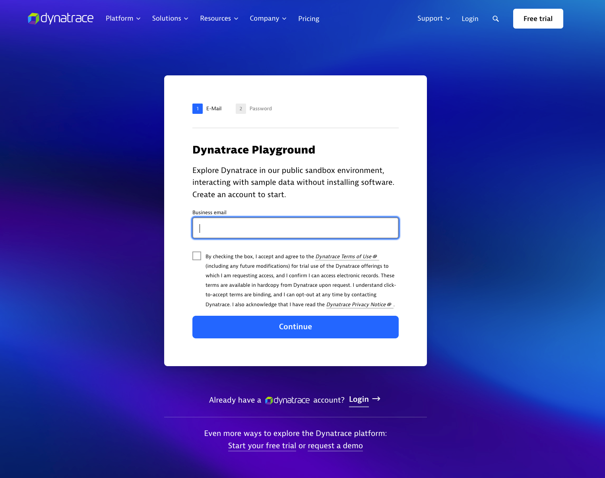

<!--TODO: Update Lab Task -->
<!--TODO: Update bizevent code snippet -->
--8<-- "snippets/send-bizevent/4-prereq.js"

## Dynatrace Playground Access

Ensure you can reach the Dynatrace playground: [Playground](https://wkf10640.apps.dynatrace.com/).

You can sign up for Playground access (non-employees) here: [Playground Signup](https://www.dynatrace.com/signup/playground/)

## Prerequisites

During this hands-on training, we will use the Dynatrace playground with Notebooks and Dashboards to explore the following:

1. **DQL 301 - Data Transformation**: Learn how to effectively use the `join`, `lookup`, `append`, and `data` commands to combine data from multiple sources, enhancing the depth and breadth of your queries.

*Future sessions*
1.	**Data Optimization**: Optimize your DQL queries with sampling, entity usage, and timeseries data, enabling better performance monitoring and analysis.
2.	**Aggregate Complex Queries**: Explore techniques for aggregating complex queries using workflows and business events, allowing for more comprehensive data analysis and reporting.

By the end of this session, students will have a deeper understanding of advanced DQL features, empowering them to leverage Dynatrace for more sophisticated and efficient data analysis.

### Training Prerequisites

* Dynatrace Playground access and/or personal sandbox tenant access

## Continue
<!--TODO: Update Continue Section -->
In the next section, we'll learn how to add Data using the data and append commands, connect Data with join and lookup, and Data transformation. 

- [Continue to Data Transformation:octicons-arrow-right-24:](5-data-transformation.md)

